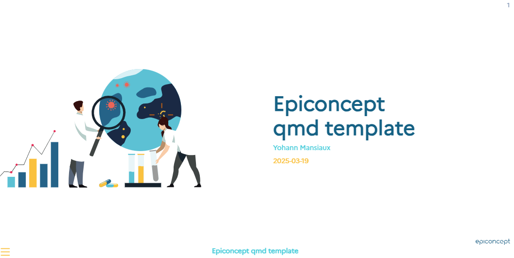

# Quarto RevealJS template for Epidemiology team

## Requirement

- Quarto 1.3.0 or later

If you don't have Quarto installed, please follow the instructions on the [Quarto website](https://quarto.org/docs/get-started/).

- The R package "quarto"

## Pre-requisites

- Markdown syntax knowledge
- Basic knowledge of HTML and CSS can be useful if you want to add your own customizations.

## Usage

To start a new presentation, please run in a terminal (not the R console):

```bash
quarto use template Epiconcept-Paris/epidemio_slides_template
```


## Example




## Contributing to this template

New contributors are welcome !

You can contribute to the template in many ways:

- By reporting bugs, issues or feature requests: please open an issue on
  the [GitHub
  repository](https://github.com/Epiconcept-Paris/epidemio_slides_template/issues).
- By fixing bugs or improving the package: please clone or fork the
  repository, work on a dedicated branch and create a pull request.